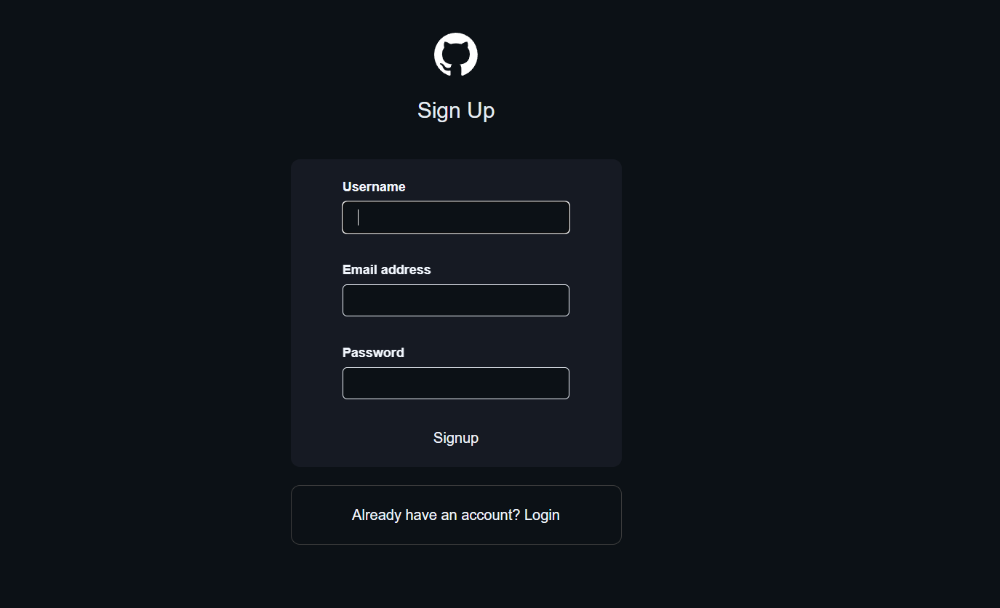
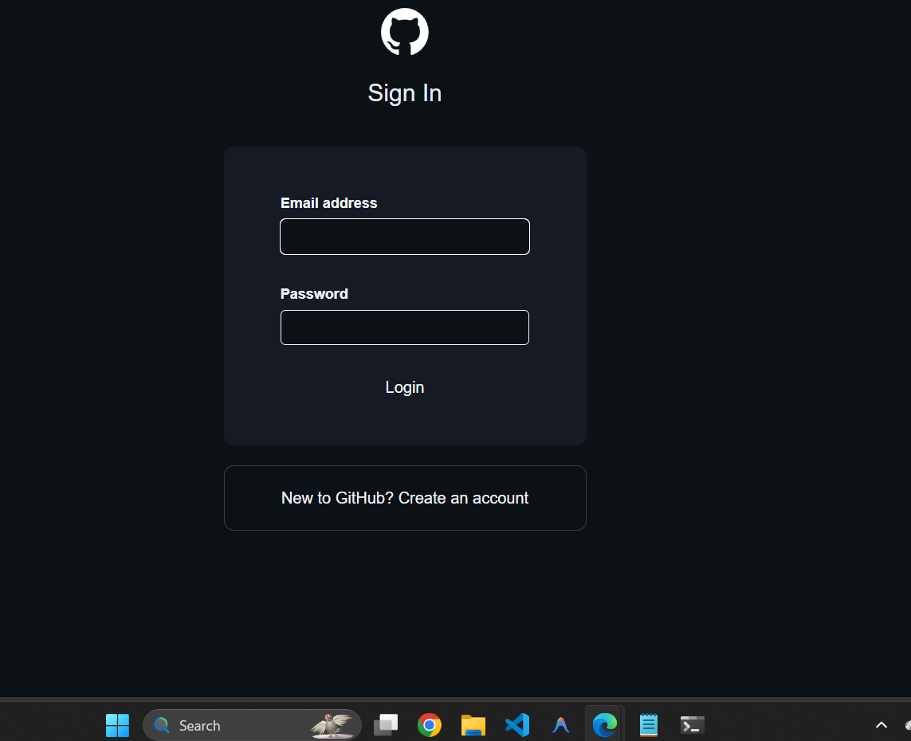
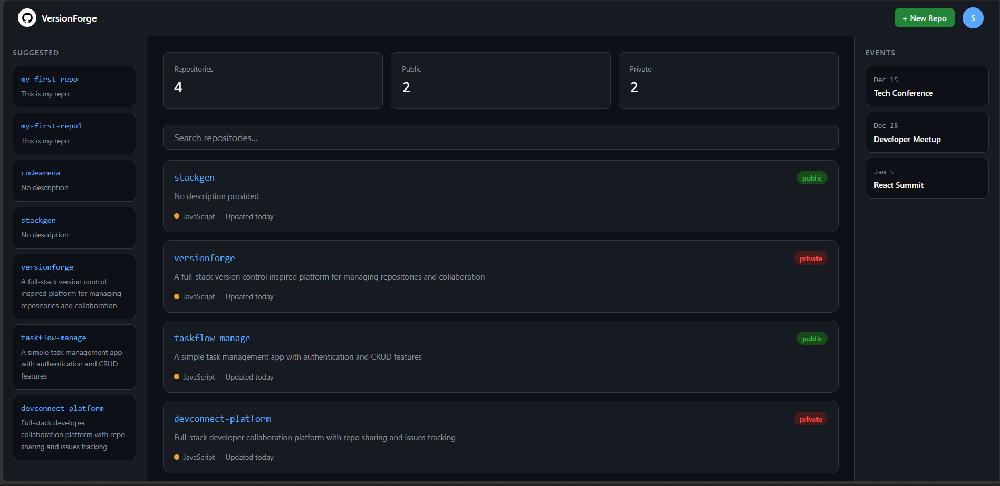
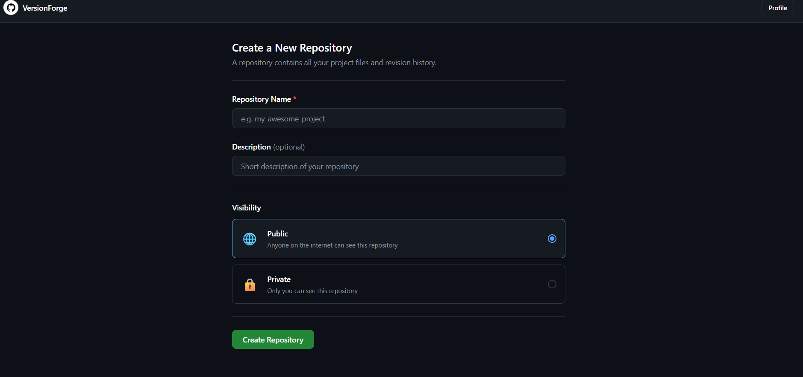
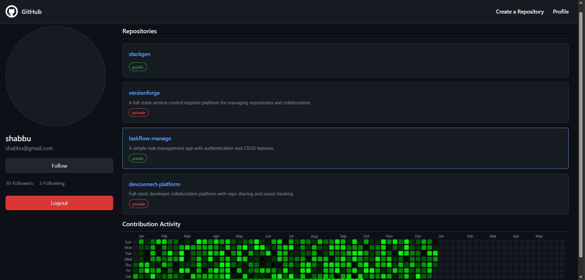

<div align="center">

# VersionForge

### A full-stack, GitHub-inspired version control platform with a custom Git-like CLI

[](https://main.d2wuybatwux9bb.amplifyapp.com)
[](https://github.com/rifaz07/versionforge)

</div>

---

<div align="center">


</div>

---

## Table of Contents

- [Overview](#overview)
- [Features](#features)
- [Architecture](#architecture)
- [Tech Stack](#tech-stack)
- [CLI Usage](#cli-usage)
- [API Reference](#api-reference)
- [Local Setup](#local-setup)
- [Environment Variables](#environment-variables)
- [Deployment](#deployment)
- [Screenshots](#screenshots)
- [Roadmap](#roadmap)
- [Author](#author)

---

## Overview

VersionForge is a full-stack version control platform built from scratch, inspired by GitHub. It pairs a **React 19 web interface** for repository and issue management with a **custom Node.js CLI** that supports Git-like operations (`init`, `add`, `commit`, `push`, `pull`, `revert`) — all backed by **AWS S3** for commit storage and **MongoDB** for user, repository, and issue metadata.

The backend runs on an **AWS EC2** instance behind **nginx** (reverse proxy) and **PM2** (process manager), with **AWS CloudFront** as a CDN in front. The frontend is deployed on **AWS Amplify** with CI/CD on every push to `main`.

---

## Features

| Feature | Description |
|---|---|
| **Custom Git-like CLI** | `init`, `add`, `commit`, `push`, `pull`, `revert` — local version control backed by S3 |
| **AWS S3 Commit Storage** | Each commit's file snapshot is serialized and stored in S3; pull restores it locally |
| **MongoDB Data Layer** | Mongoose schemas for users, repositories, and issues |
| **JWT + bcrypt Auth** | Stateless authentication with signed tokens and hashed passwords |
| **15+ REST API Endpoints** | Full CRUD for users, repos, and issues |
| **Public / Private Repos** | Toggle repository visibility with a single API call |
| **Issue Tracking** | Create, update, and delete issues scoped to each repository |
| **Real-time Notifications** | Socket.io room-based events pushed to connected clients |
| **Activity Heatmap** | GitHub-style contribution heatmap rendered on user profile pages |
| **Role-based Middleware** | Authorization guards on all write-access routes |

---

## Architecture

```
                      ┌──────────────────────────────┐
                      │        GitHub (Source)        │
                      └──────────┬───────────┬────────┘
                                 │           │
                                 ▼           ▼
                    ┌────────────────┐  ┌─────────────────────────────────┐
                    │  AWS Amplify   │  │         AWS EC2 Instance         │
                    │ (CI/CD + CDN)  │  │                                  │
                    │                │  │  ┌─────────┐   ┌─────────────┐  │
                    │  React 19 +    │  │  │  nginx  │──▶│  PM2        │  │
                    │  Vite +        │  │  │ (proxy) │   │  Node.js /  │  │
                    │  Tailwind CSS  │  │  └────┬────┘   │  Express 5  │  │
                    └───────┬────────┘  │       │        │  Socket.io  │  │
                            │           │       ▼        └─────────────┘  │
                            │           │  ┌──────────────────────────┐   │
                            │           │  │    AWS CloudFront (CDN)   │   │
                            │           │  └──────────────────────────┘   │
                            │           └─────────────────────────────────┘
                            │                          │
                            └──────────┬───────────────┘
                                       │  REST + WebSocket
                          ┌────────────┼────────────┐
                          ▼                         ▼
                 ┌──────────────────┐     ┌──────────────────┐
                 │  MongoDB Atlas   │     │     AWS S3        │
                 │  Users / Repos / │     │  Commit Storage   │
                 │  Issues          │     │  (ap-south-1)     │
                 └──────────────────┘     └──────────────────┘

  ┌─────────────────────────────────────────────────────────┐
  │  Developer Machine — VersionForge CLI (Node.js + Yargs) │
  │  node index.js push  ──────────────────────────▶  S3    │
  │  node index.js pull  ◀──────────────────────────  S3    │
  └─────────────────────────────────────────────────────────┘
```

---

## Tech Stack

| Layer | Technology |
|---|---|
| **Frontend** | React 19, Vite, Tailwind CSS, React Router v7 |
| **Backend** | Node.js 20, Express.js 5, Socket.io 4 |
| **Database** | MongoDB Atlas, Mongoose |
| **Storage** | AWS S3 (`ap-south-1`) |
| **Auth** | JWT, bcrypt |
| **CLI** | Node.js, Yargs, UUID |
| **Infra** | AWS EC2, nginx, PM2, AWS CloudFront |
| **Frontend Deploy** | AWS Amplify (CI/CD on push to `main`) |

---

## CLI Usage

VersionForge ships a Git-like CLI for local version control backed by AWS S3:

```bash
# Initialize a new repository in the current directory
node index.js init

# Stage a file for the next commit
node index.js add <filename>

# Commit all staged files with a message
node index.js commit "your commit message"

# Push all local commits to AWS S3
node index.js push

# Pull commits from AWS S3 (restores files locally)
node index.js pull

# Revert the working directory to a specific commit
node index.js revert <commitID>

# Start the HTTP + WebSocket server
node index.js start
```

**Example workflow:**

```bash
node index.js init
node index.js add hello.txt
node index.js commit "initial commit"
node index.js push
# → All commits pushed to S3.
```

---

## API Reference

### Auth

| Method | Endpoint | Auth | Description |
|---|---|---|---|
| `POST` | `/signup` | ❌ | Register a new user |
| `POST` | `/login` | ❌ | Authenticate and receive a JWT |

### Users

| Method | Endpoint | Auth | Description |
|---|---|---|---|
| `GET` | `/allUsers` | ❌ | List all users |
| `GET` | `/userProfile/:id` | ❌ | Fetch a user profile |
| `PUT` | `/updateProfile/:id` | ✅ | Update a user profile |
| `DELETE` | `/deleteProfile/:id` | ✅ | Delete a user account |

### Repositories

| Method | Endpoint | Auth | Description |
|---|---|---|---|
| `GET` | `/repo/all` | ❌ | List all public repositories |
| `GET` | `/repo/user/:userID` | ❌ | Get repositories for a user |
| `GET` | `/repo/:id` | ❌ | Get a single repository |
| `POST` | `/repo/create` | ✅ | Create a repository |
| `PUT` | `/repo/update/:id` | ✅ | Update repository metadata |
| `DELETE` | `/repo/delete/:id` | ✅ | Delete a repository |
| `PATCH` | `/repo/toggle/:id` | ✅ | Toggle public / private visibility |

### Issues

| Method | Endpoint | Auth | Description |
|---|---|---|---|
| `POST` | `/issue/create/:id` | ✅ | Create an issue on a repo |
| `GET` | `/issue/all/:id` | ❌ | List all issues for a repo |
| `GET` | `/issue/:id` | ❌ | Get a single issue |
| `PUT` | `/issue/update/:id` | ✅ | Update an issue |
| `DELETE` | `/issue/delete/:id` | ✅ | Delete an issue |

---

## Local Setup

### Prerequisites

- Node.js 20+
- MongoDB Atlas account (or local MongoDB)
- AWS account with an S3 bucket

### 1. Clone the repository

```bash
git clone https://github.com/rifaz07/versionforge.git
cd versionforge
```

### 2. Backend

```bash
cd backend
npm install
```

Create a `.env` file inside `/backend` (see [Environment Variables](#environment-variables) below), then start the server:

```bash
node index.js start
```

### 3. Frontend

```bash
cd frontend
npm install
```

Create a `.env` file inside `/frontend`:

```env
VITE_API_URL=http://localhost:3000
```

Start the dev server:

```bash
npm run dev
```

The app will be available at `http://localhost:5173`.

---

## Environment Variables

### Backend — `/backend/.env`

```env
PORT=3000
MONGODB_URI=mongodb+srv://<user>:<password>@cluster.mongodb.net/versionforge
JWT_SECRET=your_jwt_secret_here
AWS_ACCESS_KEY_ID=your_aws_access_key_id
AWS_SECRET_ACCESS_KEY=your_aws_secret_access_key
AWS_REGION=ap-south-1
S3_BUCKET=your_s3_bucket_name
```

### Frontend — `/frontend/.env`

```env
VITE_API_URL=http://localhost:3000
```

> **Note:** Never commit `.env` files. They are listed in `.gitignore`.

---

## Deployment

| Layer | Platform | URL |
|---|---|---|
| Frontend | AWS Amplify | https://main.d2wuybatwux9bb.amplifyapp.com |
| Backend | AWS EC2 + nginx + PM2 | Behind CloudFront CDN |
| Database | MongoDB Atlas | Cloud-hosted |
| Storage | AWS S3 (`ap-south-1`) | Cloud-hosted |

### Frontend — AWS Amplify

The `amplify.yml` at the project root handles the monorepo build and deploys on every push to `main`:

```yaml
version: 1
applications:
  - frontend:
      phases:
        preBuild:
          commands:
            - npm install
        build:
          commands:
            - npm run build
      artifacts:
        baseDirectory: dist
        files:
          - '**/*'
    appRoot: frontend
```

### Backend — EC2 + nginx + PM2

The backend runs as a managed Node.js process via **PM2** on an AWS EC2 instance. **nginx** acts as a reverse proxy, forwarding port 80/443 traffic to the Node.js server. **AWS CloudFront** sits in front of the EC2 instance as a CDN for caching and HTTPS termination.

```
Internet → CloudFront → nginx (EC2) → PM2 → Node.js / Express / Socket.io
```

Key PM2 command used in production:

```bash
pm2 start index.js --name versionforge -- start
```

---

## Project Structure

```
versionforge/
├── amplify.yml                   # AWS Amplify monorepo build config
├── frontend/                     # React 19 + Vite frontend
│   └── src/
│       ├── components/
│       │   ├── auth/             # Login & Signup pages
│       │   ├── dashboard/        # User dashboard
│       │   ├── repo/             # Repository views
│       │   └── user/             # Profile & activity heatmap
│       ├── api.js                # Axios base config
│       ├── authContext.jsx       # Auth context provider
│       └── Routes.jsx            # App router
└── backend/                      # Node.js + Express backend
    ├── controllers/
    │   ├── init.js               # CLI: repo initialisation
    │   ├── add.js                # CLI: stage files
    │   ├── commit.js             # CLI: create a commit
    │   ├── push.js               # CLI: push commits to S3
    │   ├── pull.js               # CLI: pull commits from S3
    │   ├── revert.js             # CLI: revert to a commit
    │   ├── repoController.js     # REST: repository CRUD
    │   ├── userController.js     # REST: user CRUD
    │   └── issueController.js    # REST: issue CRUD
    ├── models/                   # Mongoose schemas
    ├── routes/                   # Express routers
    ├── middleware/               # JWT auth middleware
    ├── config/                   # AWS S3 config
    └── index.js                  # Entry point — CLI + HTTP server
```

---

## Screenshots

### Sign Up


### Sign In


### Dashboard


### Create Repository


### User Profile & Activity Heatmap


---

## Roadmap

- [ ] Connect CLI commit history to the web UI (show commits on repo page)
- [ ] Branch support in the CLI
- [ ] Diff viewer for commit snapshots
- [ ] Pull request / merge request workflow
- [ ] Migrate AWS SDK v2 → v3

---

## Author

**Rifaz Shaikh Razak**

[](https://github.com/rifaz07)
